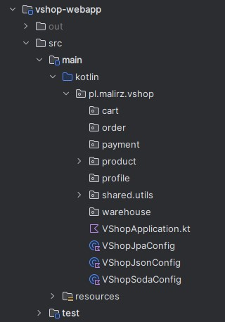

# VShop

Online Shop Application created for educational purpose to test different technologies, architectural and design styles.
**V**Shop stands for **V**ertically sliced. For the sake of simplicity the application is stored in the one project 
as a modular monolith. Business functions are layered in separate packages (modules) and can be easily extracted to 
separate microservices.

<!-- TOC -->
* [VShop](#vshop)
  * [Architecture](#architecture)
    * [Infrastructure](#infrastructure)
    * [Functional modules (Domain)](#functional-modules-domain)
  * [Prerequisites](#prerequisites)
  * [Run the app TL;DR;](#run-the-app-tldr)
  * [Initialize the infrastructure](#initialize-the-infrastructure)
    * [1. Docker configuration](#1-docker-configuration)
    * [2. Start the infrastructure](#2-start-the-infrastructure)
    * [3. Database initialization](#3-database-initialization)
  * [Run the application](#run-the-application)
<!-- TOC -->

## Architecture

### Infrastructure

- Infinispan 14 (connected to Oracle XE)
- Oracle 21c XE
    - Two users are created on first setup (vshop and vshopcache) -
      see [SQL init scripts](./vshop-docker/oracle/scripts/setup)
        - **vshopcache** user is dedicated to the Infinispan JDBC persistent storage
        - **vshop** user is the application user

### Functional modules (Domain)

The whole application for the development simplicity is stored in the one project (and the deployment package). However,
the application is vertically sliced into the separate functional modules (domains). Modules are expressed as packages.



As the project is under development and for the learning purposes the modules will be added gradually.
The following modules are already implemented:
- **products**

## Prerequisites

- Docker
- JDK 17

## Run the app TL;DR;

```shell
gradlew initDocker
docker-compose up -d oracle21c
gradlew build
gradlew bootRun --args='--spring.profiles.active=JSON'
```

## Initialize the infrastructure

### 1. Docker configuration

Before you run the docker compose command please initialize the project:

```shell
gradlew initDocker
```

It will download the Oracle JDBC jar for you (from the Maven Central) placing it to
the `vshop-docker/infinispan/server/lib`. This folder is dedicated to the Infinispan 3rd party libraries. Read more
about the Infinispan `server`
folder https://infinispan.org/docs/stable/titles/server/server.html#server_root_directory

### 2. Start the infrastructure

Go to the `vshop-docker` and run the following command

```shell
docker-compose up -d
```

It will start Oracle 21c XE instance and Infinispan 14 (connected to the Oracle DB).

**Note!** that the in the current version of the project the Infinispan is not used thus it is not necessary to start
it. Thus, you can run only the following command:

```shell
docker-compose up -d oracle21c
```

### 3. Database initialization

Before you run the application you need to initialize the database. The following task will create all the necessary
tables for all spring profiles (JPA, SODA, JSON).

```shell
gradlew dbInit
```

## Run the application

The application is configured to run with the following profiles: `JPA`, `SODA`, `JSON` together with the `INIT`
profile. The `INIT` profile is used to initialize the database with the fake / generated data. The `INIT` profile can be
used in combination with any of the other profiles.

- `JPA` profile is used to run the application with the JPA (Hibernate) persistence layer.

```shell
gradlew bootRun --args='--spring.profiles.active=JPA'
```

- `SODA` profile is used to run the application with the Oracle SODA persistence layer.

 ```shell
gradlew bootRun --args='--spring.profiles.active=SODA'
```

- `JSON` profile is used to run the application with the Oracle JSON persistence layer.

```shell
gradlew bootRun --args='--spring.profiles.active=JSON'
```

You can run each profile together with the `INIT` profile to initialize the database with the random data.

```shell
gradlew bootRun --args='--spring.profiles.active=JSON,INIT'
```

There are following initializers build in the application:

- `pl.malirz.vshop.product.initializer.ProductsDatabaseInitializer` - generates random products. The number of `Prouct`s
  generated is defined by the
  `vshop.products.generated.initial.count` property (see
  the [application.yaml](vshop-webapp/src/main/resources/application.yaml)).

## Access the application

At the time the only way to access application is to use the Swagger UI. The Swagger UI is available under the following 
URL: http://localhost:8080/swagger-ui/index.html

